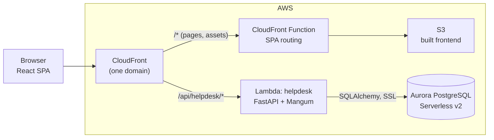
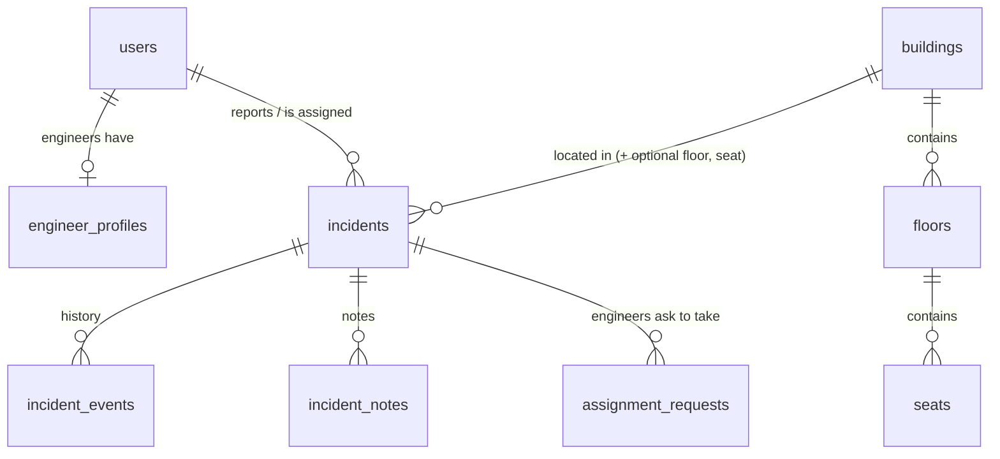
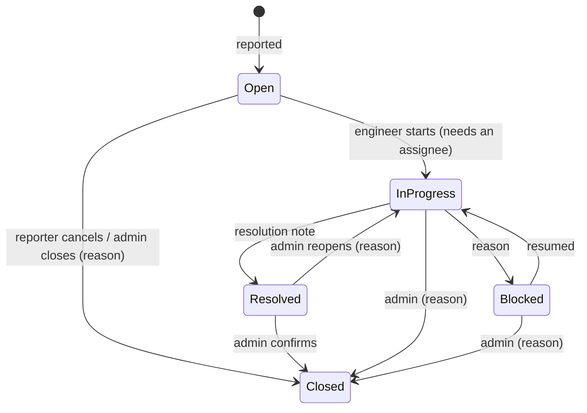

# ACME Facilities Helpdesk

A facility incident management platform for ACME Inc. Employees report problems in the
buildings (a broken chair, a Wi-Fi outage, a leaking pipe), facility admins route them to the
right engineer, and everyone follows each incident from **Open** to **Closed**, with notes and
a full history along the way.

- **Live:** https://dieilg51k5yf9.cloudfront.net (AWS: CloudFront + Lambda + Aurora PostgreSQL)
- **Stack:** React 19 + Material UI 9 + React Responsive · Python 3.13 FastAPI on AWS Lambda ·
  PostgreSQL (Aurora Serverless v2)
- **Status:** every feature in the brief is implemented for all three roles; 260 backend tests
  (98% coverage), 175 frontend tests (93% coverage) and 16 end-to-end browser journeys pass. See
  [Known gaps](#known-gaps-and-next-steps).

> This file documents the project built on top of the workshop template. The template's own
> guide is [README.md](README.md) and [docs/](docs/).

## Contents

1. [What each role can do](#what-each-role-can-do)
2. [Architecture](#architecture)
3. [Data model and incident workflow](#data-model-and-incident-workflow)
4. [Security and access control](#security-and-access-control)
5. [Run it locally](#run-it-locally)
6. [Tests](#tests)
7. [Deploy to AWS](#deploy-to-aws)
8. [Design decisions and trade-offs](#design-decisions-and-trade-offs)
9. [Changes to the workshop template](#changes-to-the-workshop-template)
10. [Assumptions](#assumptions)
11. [Known gaps and next steps](#known-gaps-and-next-steps)

## What each role can do

| | Employee | Engineer | Facility admin |
| --- | --- | --- | --- |
| **Sign up / sign in** | Register with an `@acme.inc` email | Account created by an admin | Account created by an admin |
| **Dashboard** | Their incidents at a glance, what needs attention, how quickly the team replies | Their workload, incidents matching their specialties, their requests, their pace | Headline numbers, needs attention, response times, daily trend and category charts, engineer workload, problem hotspots by building / floor / seat |
| **Incidents** | Report, track, edit while Open, cancel with a reason, escalate, add notes | Report; request to take open incidents (admin approves); start, block, resolve; notes; "My work", "Available" and "My reports" lists | Everything: assign / reassign / unassign, set priority, remove escalation, reopen, close, delete; filter by building and floor with a live count |
| **Admin** | | | Approve or turn down engineers' requests; manage buildings, floors and seats; manage users, roles, engineer specialties and availability; reset passwords |
| **Account** | Profile, change password, light / dark theme | + availability (Available / Busy / Off duty) and phone | Same as employee |

Every list has search, filters, sorting and paging (kept in the URL); every page works from a
390px phone to a desktop, in light and dark mode.

## Architecture



- **One origin for app and API.** CloudFront serves the frontend from S3 and routes
  `/api/helpdesk/*` to the Lambda Function URL, so the browser never makes cross-origin
  requests. Locally, Vite proxies `/api/helpdesk` to uvicorn, so the frontend code is identical.
- **Backend** ([backend/helpdesk](backend/helpdesk)): one FastAPI service, organised by domain
  (`auth`, `users`, `facilities`, `incidents`, `reports`), each with routes → service (rules) →
  SQLAlchemy models, plus Pydantic schemas for every request and response. `function.py`
  adapts it to Lambda with Mangum. Interactive API docs at `/api/helpdesk/docs`.
- **Frontend** ([frontend](frontend)): React Router pages grouped by feature (`auth`,
  `incidents`, `dashboard`, `requests`, `facilities`, `users`, `account`), a small `api.js`
  client (tokens, error envelope, silent token refresh), and shared components. All colors come
  from design tokens ([frontend/DESIGN.md](frontend/DESIGN.md)); a test fails if a component
  hardcodes one.
- **Infrastructure** ([infra](infra)): the workshop's Terraform, with a few small, deliberate
  changes listed in [Changes to the workshop template](#changes-to-the-workshop-template).

More detail: [backend README](backend/helpdesk/README.md) (endpoints, workflow rules, reports),
[frontend README](frontend/README.md) (layout, scripts), [design system](frontend/DESIGN.md).

## Data model and incident workflow



- One `users` table with a `role` (employee / engineer / admin); engineers have one
  `engineer_profiles` row (at least one specialty, availability, phone).
- Incidents keep lifecycle timestamps (`acknowledged_at`, `assigned_at`, `resolved_at`,
  `closed_at`) for response-time reporting, and every change is appended to `incident_events`.
- Deleting a building, floor, seat or user that an incident refers to is refused (409);
  users with history are deactivated instead.



The rules live in one place, [workflow.py](backend/helpdesk/app/incidents/workflow.py), with
no database code, and the API tells the UI which moves and actions each user may make
(`allowed_transitions`, `allowed_actions`), so buttons only appear when they will work.

## Security and access control

- **Passwords:** scrypt (Python standard library), never returned by the API. Policy:
  10+ characters with a letter and a number, checked on both sides.
- **Tokens:** JWT access tokens (30 min) and refresh tokens (7 days). Every token carries a
  version number; changing or resetting a password bumps it, which signs the user out
  everywhere else.
- **Roles are read from the database on every request**, so role changes and deactivation
  take effect immediately. Permissions are checked centrally in the backend; the UI hides
  what the user can't do but is never the only check.
- **Visibility:** employees see what they reported; engineers see their assigned work, their
  own reports and the open, unassigned pool; admins see everything. Invisible incidents
  return 404, not 403, so their existence isn't revealed.
- **Admin safety rails:** admins can't delete, deactivate or demote themselves, and there is
  always at least one active admin (enforced with row locks, so two admins can't demote each
  other at the same time).
- **New accounts and resets** get a temporary password that must be changed at first sign-in.
  The first cloud admin (`admin@acme.inc`) gets a password generated by Terraform.
- **Consistent errors:** every error is `{"error": {"code", "message", "fields"}}` with the
  right status (400 validation, 401, 403, 404, 409 conflicts, 503 database unavailable).

## Run it locally

**Prerequisites:** Python 3.13, Node 22, and PostgreSQL on `localhost:5432` with user
`postgres` / password `postgres123` (the workshop machine has these).

```sh
# 1. API on http://localhost:8000 (docs at /docs)
cd backend/helpdesk
python3 -m venv .venv && .venv/bin/pip install -r requirements-dev.txt        # once
PGPASSWORD=postgres123 psql -h localhost -U postgres -c "CREATE DATABASE helpdesk_dev"   # once
cp .env.sample .env.local                                                      # once
.venv/bin/uvicorn app.main:app --reload

# 2. App on http://localhost:3000 (second terminal)
cd frontend
npm install                                                                     # once
npm run dev
```

Each start loads **demo data** if it's missing: 12 users across all roles, 3 buildings with
floors and seats, and 22 incidents covering every status and workflow step, backdated over
30 days so the dashboards have something to show. The sign-in page has one-click demo buttons
in development. All demo passwords are **`Password123`**:

| Role | Accounts |
| --- | --- |
| Admin | `admin@acme.inc`, `morgan.facilities@acme.inc` |
| Engineer | `priya.shah@acme.inc`, `sam.rivera@acme.inc`, `diego.martinez@acme.inc`, `lee.chen@acme.inc`, `tom.okafor@acme.inc` |
| Employee | `maria.garcia@acme.inc`, `jane.doe@acme.inc`, `john.smith@acme.inc`, `nina.patel@acme.inc` (must set a new password), `chris.taylor@acme.inc` (deactivated) |

To start over: `cd backend/helpdesk && .venv/bin/python -m app.seed --reset` (wipes the
local database, then reloads the demo data).

## Tests

| | Command | Result |
| --- | --- | --- |
| Backend unit + integration | `cd backend/helpdesk && .venv/bin/pytest --cov=app` | 260 passed, 98% line coverage |
| Backend lint | `.venv/bin/python -m pylint app function.py` | 10.00 / 10 |
| Frontend components + API client | `cd frontend && npm test` | 175 passed |
| Frontend coverage | `npm run test:coverage` | 93.1% lines · 91.3% statements · 91.6% functions · 83.2% branches (fails below 80%) |
| End-to-end (real browser, API and database) | `cd frontend && npm run test:e2e` | 16 passed (desktop + phone) |
| Load test (Artillery) | `cd loadtest && npm run load -- --target <site>` | Deployed site: 9,884 requests, 0 failed, p95 495 ms, p99 934 ms |
| Frontend lint / build | `npm run lint` · `npm run build` | clean |

**Backend.** Unit tests cover the workflow rules, validation models, password and token
handling, and Lambda event routing without a database. Integration tests call every endpoint
through FastAPI's test client against a real PostgreSQL database (`helpdesk_test`, recreated
for each run; they are skipped if PostgreSQL isn't reachable), including permissions for each
role, validation and conflict errors, concurrent assignment approvals, the last-admin rule,
and report numbers checked against the demo data by hand.

**Frontend.** Vitest and Testing Library render real pages with a fake API and act like a user:
sign-in and registration errors, forced password change, reporting (building → floor → seat),
every incident action per role, filters and paging, dashboards (including chart table views),
admin user and facility management, phone vs desktop layouts, theme switching, and the rule
that no component hardcodes a color.

**End-to-end.** Playwright drives Chromium through the critical journeys against the real API
and PostgreSQL (its own `helpdesk_e2e` database, reset with demo data on every run): the full
incident lifecycle across all three roles (report → assign → start → note → resolve → close →
reporter sees the outcome), an engineer's request and the admin's approval, registration, the
forced password change, sign-in errors, sessions surviving reloads, role-based access checked
in the UI **and** at the API (403s), building / floor filtering with the live count, and
reporting from a phone. The same suite can run against the **deployed site**
(`E2E_BASE_URL=… E2E_PASSWORD=… npm run test:e2e`; 15 of 16 journeys, skipping one that can only
succeed once). Details: [frontend/e2e/README.md](frontend/e2e/README.md).

**Manual validation on AWS** (after each deploy): health check through CloudFront, a real 404
returned as JSON, first-admin sign-in and forced password change, reloading a deep link
(for example `/incidents/12`), loading demo data, and reading the Lambda `REPORT` log lines for
cold-start and request times.

**Load.** An Artillery scenario ([loadtest](loadtest/README.md)) replays realistic, read-only
traffic (employees checking incidents, admins on the dashboard, sign-ins) ramping to 10 new
visitors per second for ~5 minutes, and fails if more than 1% of visitors hit an error or if
p95 / p99 exceed 2 s / 5 s.

Against the deployed site (128 MB Lambda) it passed every check: 9,884 requests with 0 failures,
median 155 ms, p95 495 ms, p99 934 ms, peaking at ~48 requests/s. Lambda memory peaked at
121 MB, and the only slow requests were cold starts and the first request while the idle
database resumed ([details](loadtest/README.md#results)).

**Known testing gaps:** none of the planned test types are missing. `src/main.jsx` (the two lines that mount the app) is excluded
from coverage; everything else in `frontend/src` is measured. See
[Known gaps](#known-gaps-and-next-steps).

## Deploy to AWS

The workshop scripts do the work; run them from the repository root. Your shell provides the
participant variables and `AWS_REGION` (us-east-2 here); the scripts refresh the temporary AWS
credentials themselves.

```sh
./bin/deploy-backend.sh     # Terraform: Lambda (packages backend/helpdesk), Aurora, S3, CloudFront
./bin/deploy-frontend.sh    # builds the React app, uploads it to S3, clears the CloudFront cache
```

Tip: `export AWS_PAGER=""` stops the AWS CLI from opening a pager (a `:` prompt) mid-script.

**Verify:**

```sh
source ENVIRONMENT.config
SITE=$(cd infra && terraform output -raw website_url)
curl -s $SITE/api/helpdesk/health                          # {"status":"ok"} (first call can take ~30 s)
curl -si $SITE/api/helpdesk/does-not-exist | head -12      # HTTP 404, JSON error (not HTML)
(cd infra && terraform output -raw admin_bootstrap_password; echo)   # first sign-in as admin@acme.inc
```

**Load demo data in the cloud (optional).** Automatic seeding never runs on AWS. An operator
with AWS credentials can load it once by invoking the Lambda directly (web requests can't
trigger this):

```sh
aws lambda invoke --function-name coding-workshop-helpdesk-$PARTICIPANT_ID \
    --cli-binary-format raw-in-base64-out \
    --payload '{"task": "seed_demo_data"}' /tmp/seed-result.json && cat /tmp/seed-result.json
```

The demo accounts get a random password, returned once in the result and never logged (add
`"password": "..."` to choose one). Details: [backend README](backend/helpdesk/README.md#demo-data-on-aws).

**Logs:** `aws logs tail /aws/lambda/coding-workshop-helpdesk-$PARTICIPANT_ID --follow --format short`

**Remove everything:** `./bin/cleanup-environment.sh`

## Design decisions and trade-offs

| Decision | Why | Trade-off |
| --- | --- | --- |
| **One FastAPI service** on Lambda (Mangum), not one Lambda per resource | Shared auth, validation, errors and transactions; free OpenAPI docs; runs unchanged under uvicorn locally | One larger package and a heavier cold start |
| **SQLAlchemy ORM + Pydantic** | Constraints, indexes and relationships defined once in the models; validation and response shapes in one place | Tables are created with `create_all` on cold start; **no migration tool yet**, so changing an existing table needs a manual `ALTER` |
| **Aurora PostgreSQL from the template** | Already provisioned, reachable inside the VPC, scales to zero when idle | The first request after an idle period waits ~15 s while Aurora resumes |
| **Engineers request, admins approve** assignments | Matches the brief: admins stay in control of who works on what | An extra step before work starts; engineers see pending and decided requests |
| **"Engineer resolves = done"**; only admins close or reopen resolved incidents | Admins confirm the outcome; reporters can still add notes or escalate | Reporters can't reopen directly; they ask via a note or escalation |
| **CloudFront Function for page URLs** (a template change) | The template's site-wide 404 → `index.html` rule also rewrote the API's JSON 404s into a fake "200 OK" page, and reloading `/incidents/12` showed S3's "Access Denied" | A small change to `infra/cloudfront.tf`; page URLs must not contain a dot |
| **Demo data via a direct Lambda invoke** (`seed_demo_data`) | The database isn't reachable from outside the VPC; only someone with AWS permissions can run it, and the password is random by default | A manual command after the first deploy |
| **Lambda stays at the template's 128 MB** | Keep the template as is | Slower cold starts (~3 s to load, 6–8 s for the first request). The Lambda sits at ~110 MB, and near 128 MB requests slowed to ~15 s: password hashing (scrypt, ~16 MB) left that memory held after each sign-in. [app/core/memory.py](backend/helpdesk/app/core/memory.py) makes the allocator hand large blocks back (measured: 16 MB returned, same security); admin pages and charts load on demand to keep the browser download small |
| **Tokens in `localStorage`** with silent refresh | Simple, works with the single-origin setup and survives reloads | Readable by any script on the page if an XSS bug existed; mitigated by React's escaping and no third-party scripts. An httpOnly cookie would be the next step |
| **Charts only where they help** (`@mui/x-charts`): daily trend and categories, each with a table view | Most dashboard data reads better as numbers, tables and ranked lists; chart colors pass color-blind and contrast checks in both themes | The chart library is ~110 kB gzipped (loaded only for admins) |

## Changes to the workshop template

Everything else lives in our own folders (`backend/helpdesk`, `frontend/src`, docs). These are
the only edits to the template's files, kept small on purpose:

| File | Change | Why |
| --- | --- | --- |
| `infra/cloudfront.tf` | Added the `spa_routing` CloudFront Function on the website route; removed the site-wide 404 → `index.html` rule | Page URLs like `/incidents/12` load the app on reload; API errors reach the app unchanged |
| `infra/main.tf`, `infra/locals.tf`, `infra/output.tf` | Generated `JWT_SECRET` and first-admin password, passed to the Lambda; the admin password is a sensitive Terraform output | No secrets in code; a known first admin on a fresh deploy |
| `infra/locals.tf` | Python packages exclude `tests/` and `requirements-dev.txt` | Smaller Lambda package with no test code |
| `bin/proxy-server.js` | Forwards the `Authorization` header | The template's local proxy dropped bearer tokens |
| `frontend/eslint.config.js` | Node globals for `*.config.js`; React plugins added to `package.json` | The starter config imported plugins it didn't install |

## Assumptions

- Everyone who uses the helpdesk has an `@acme.inc` email; self-registration always creates an
  **employee**, and only admins grant the engineer or admin role.
- A location is always a building; floor and seat are optional (a seat needs its floor).
- The reporter suggests a priority; admins set the final one. Anyone can escalate their own
  active incident once; admins can remove the escalation.
- Engineers can have several specialties; specialties guide who is suggested for an incident
  but don't restrict assignment.
- Times are stored in UTC and shown in each viewer's local time; the dashboard's per-day trend
  uses UTC days.
- No email or chat notifications: people see updates in the app (dashboards, notes, history).

## Known gaps and next steps

- **Database migrations** (for example Alembic) before the schema changes again.
- **Performance at 128 MB:** measure cold start and sign-in from the Lambda logs; if needed,
  warm the Lambda and database when the sign-in page opens, and import rarely used modules lazily.
- **Live updates:** lists and dashboards refresh when you act or reload, not in real time.
- **Hardening for production:** rate limiting on sign-in, httpOnly cookies for tokens, a
  custom domain and certificate, and notifications (email / chat) for assignments and updates.
